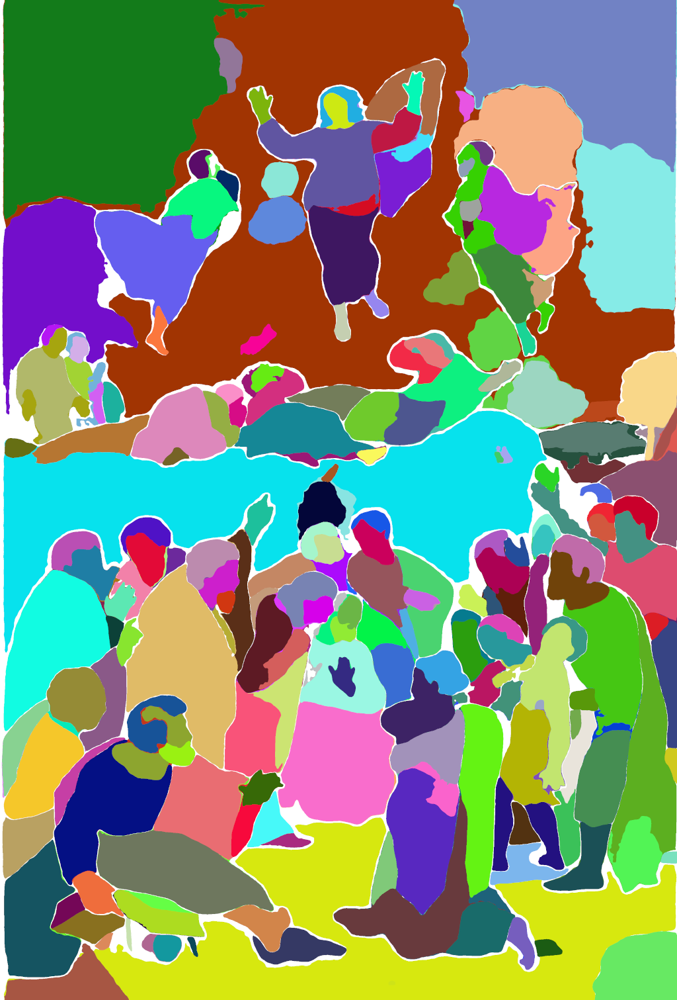
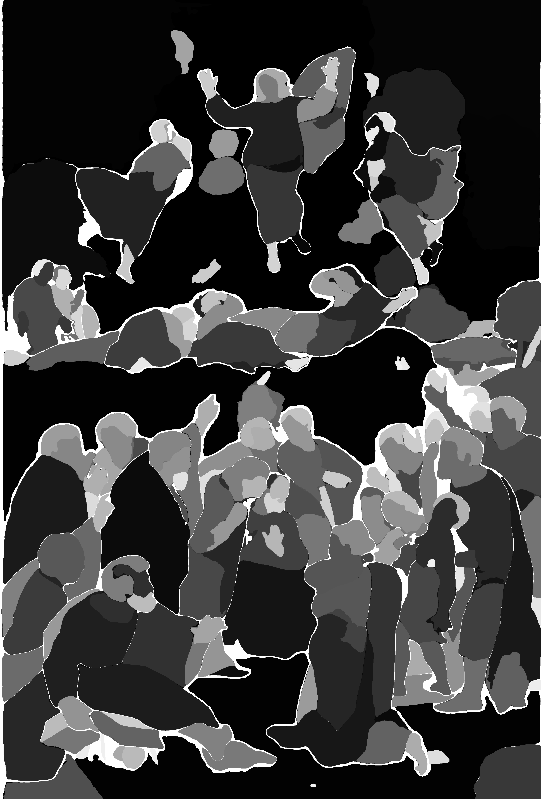

# segmentation_assisted_map_generator

## General
This repository contains the source code for the "Segmentation-Assited Map Generator" program that we developed as part of our research work. We have sent a paper to a journal.
This program creates maps using the semantic segmentation for improving the results.
All the information can be found in [XMapsLab](https://calipso.ugr.es/xmapslab.org)

## Installation
### SAMG
Installing and running the SAMG program is very easy because is a coded in Python. For the installation you have to use the "requirements.txt" file to install all the necessary modules. 
The code is include in folder `samg`. For using "samg.py" program is neccesary to previously to prepare the input data. This is made by creating individual projects. 
A project is a folder. The name of the folder must be representative, for example, the name of the artwork. It must contains these subfolders and files:
* `images`: It contains the photo of the image
* `masks`: It contains the masks that are created as commented below
* `positions`: It will contain the images produced with the positions
* `xrf`: It contains the data for XRF data in several subfolders
    * `maps': It contains the produced maps
* `xrd`: It contains the data for XRD data in several subfolders (the same as XRF)
* `project_data.csv`: A CSV file with the scanned data.

If you want to check the program, please, request some example projects by email to <dmartin@ugr.es>

### Creation of masks images

For running the program `create_masks_images.py`, you have to follow these steps:
1. Download the code and install SAM [SAM](https://github.com/facebookresearch/segment-anything)
2. Copy the file `create_masks_images.py` in the SAM folder
3. Create a folder called `images`. It will contain the original image of the project, the one included in the `images` subfolder of the project.
4. Create a folder called `masks`. It will contain the images produced by the program.
5. Run the program

Once the two images are created, they must copy in the subfolder `masks`. Then SAMG program can be run using the complete project.

